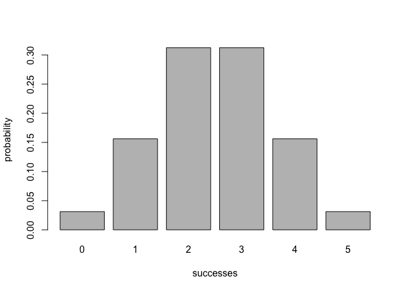
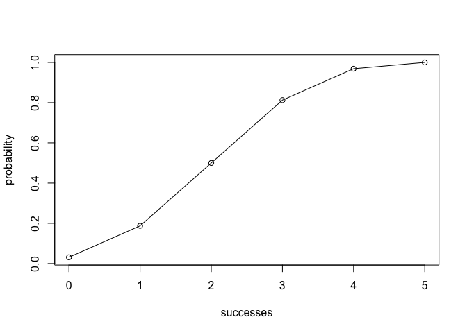

README.Rmd
================

Overview
--------

"Binomial" is a package that implements functions for calculating probabilities of a Binomial random variable, and related calculations such as the probability distribution, the expected value, variance, etc. Some examples of these functions are:

-   'bin\_distribution()' creates a dataframe (of class 'binomial distribution')
-   'bin\_cumulative()' creates a dataframe (of class binomial cumulative distribution)
-   'plot()' method for a 'bin\_distribution' and 'bin\_cumulative' object to plot probabilities of successes.
-   'bin\_variable()' creates a list object (of class binomial random variable)
-   'summary()' method for a binomial variable object

Motivation
----------

This package was created as a part of Workout3 for Stat 133.

Installation
------------

Install the development version from GitHub via the package `"devtools"`:

``` r
# development version from GitHub:
#install.packages("devtools") 
# install "cointoss" (without vignettes)
devtools::install_github("divyavijay14/stat133-spring19/Binomial")
#> Downloading GitHub repo divyavijay14/stat133-spring19@master
#>   
✔  checking for file ‘/private/var/folders/59/5gjvvvn915s8sv9jp1gxzg5c0000gn/T/RtmpB7pQQ0/remotesed46226b7e9b/divyavijay14-stat133-spring19-d490550/Binomial/DESCRIPTION’
#> 
  
─  preparing ‘Binomial’:
#> ✔  checking DESCRIPTION meta-information
#> 
  
─  checking for LF line-endings in source and make files and shell scripts
#> 
  
─  checking for empty or unneeded directories
#> ─  building ‘Binomial_0.1.0.tar.gz’
#> 
  
   
#> 
#> Warning in i.p(...): installation of package '/var/folders/
#> 59/5gjvvvn915s8sv9jp1gxzg5c0000gn/T//RtmpB7pQQ0/fileed4620fd7881/
#> Binomial_0.1.0.tar.gz' had non-zero exit status
# install "cointoss" (with vignettes)
devtools::install_github("divyavijay14/stat133-spring19/Binomial", build_vignettes = TRUE)
#> Downloading GitHub repo divyavijay14/stat133-spring19@master
#>   
   checking for file ‘/private/var/folders/59/5gjvvvn915s8sv9jp1gxzg5c0000gn/T/RtmpB7pQQ0/remotesed462a992eb3/divyavijay14-stat133-spring19-d490550/Binomial/DESCRIPTION’ ...
  
✔  checking for file ‘/private/var/folders/59/5gjvvvn915s8sv9jp1gxzg5c0000gn/T/RtmpB7pQQ0/remotesed462a992eb3/divyavijay14-stat133-spring19-d490550/Binomial/DESCRIPTION’ (357ms)
#> 
  
─  preparing ‘Binomial’:
#> 
  
   checking DESCRIPTION meta-information ...
  
✔  checking DESCRIPTION meta-information
#> 
  
─  checking for LF line-endings in source and make files and shell scripts
#> 
  
─  checking for empty or unneeded directories
#> ─  building ‘Binomial_0.1.0.tar.gz’
#> 
  
   
#> 
#> Warning in i.p(...): installation of package '/var/folders/
#> 59/5gjvvvn915s8sv9jp1gxzg5c0000gn/T//RtmpB7pQQ0/fileed46295ddd48/
#> Binomial_0.1.0.tar.gz' had non-zero exit status
```

Usage
-----

``` r
library(Binomial)

bin_probability(success = 2, trials = 5, prob = 0.5)
#> [1] 0.3125

#creates a dataframe of probabilities of successes
bin_distribution(trials = 5, prob = 0.5)
#>   success probability
#> 1       0     0.03125
#> 2       1     0.15625
#> 3       2     0.31250
#> 4       3     0.31250
#> 5       4     0.15625
#> 6       5     0.03125

#plots that binomial distribution
dis1 <- bin_distribution(trials = 5, prob = 0.5)
plot(dis1)
```



``` r

#creates a dataframe of cumulative probabilities of successes
bin_cumulative(trials = 5, prob = 0.5)
#>   success probability cumulative
#> 1       0     0.03125    0.03125
#> 2       1     0.15625    0.18750
#> 3       2     0.31250    0.50000
#> 4       3     0.31250    0.81250
#> 5       4     0.15625    0.96875
#> 6       5     0.03125    1.00000

#plots that cumulative binomial distribution
dis2 <- bin_cumulative(trials = 5, prob = 0.5)
plot(dis2)
```



``` r

#gives us summary statistics on this binomial random variable
bin1 <- bin_variable(trials = 5, p = 0.5)
binsum1 <- summary(bin1)
binsum1
#> "Summary Binomial"
#> 
#> Parameters
#> - number of trials : 5
#> - prob of success : 0.5
#> 
#> Measures
#> - mean : 2.5
#> - variance : 1.25
#> - mode : 3
#> - skewness : 0
#> - kurtosis : -0.4
```
